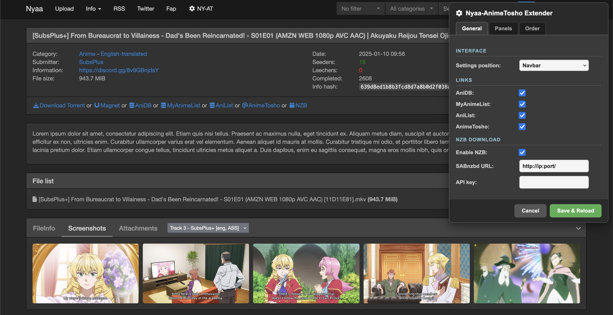
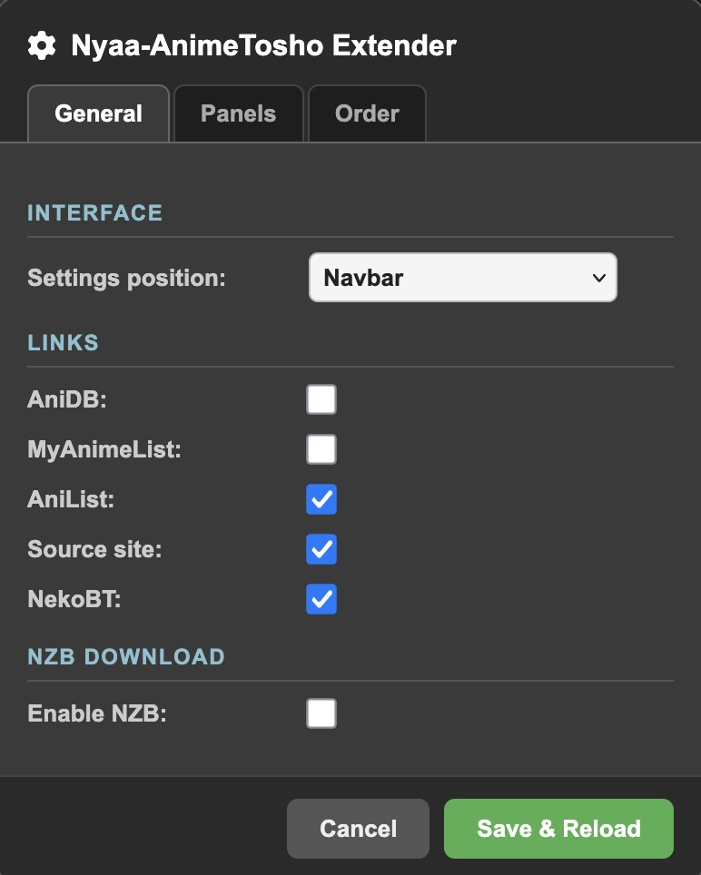
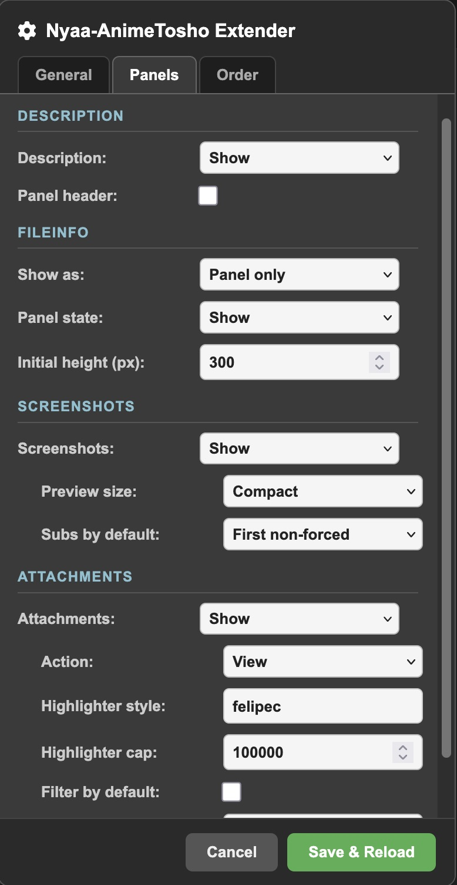
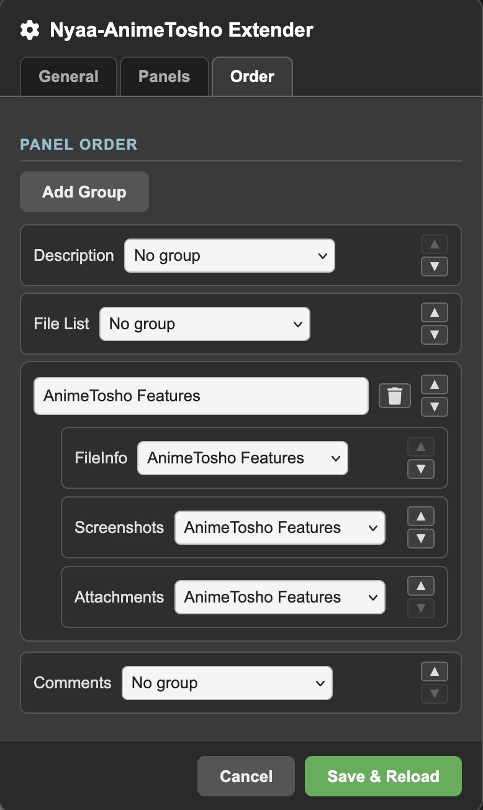
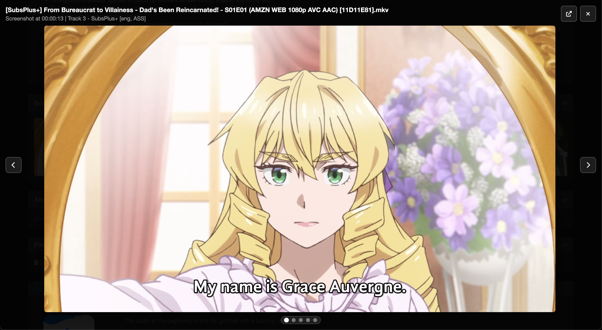
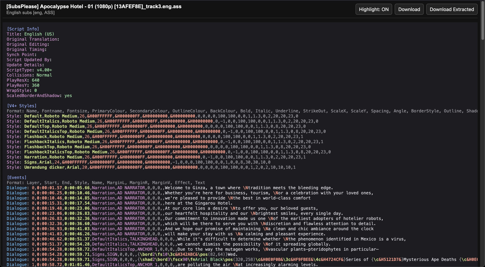

# Nyaa AnimeTosho Extender ION Fork

User script that extends nyaa.si/view page with AnimeTosho information. All information comes from [AnimeTosho.org](https://animetosho.org/) (Pre 2026-05-09), [Tsukihime.org](https://tsukihime.org), and [AnimeTosho.xyz](https://animetosho.xyz/). They only scrapes a subset of all releases in the Anime category, may skip certain files, and takes time to process new episodes so not all pages will have complete information.

### Functionality
- Link to Source page
- NZB link with option for unique sabUrl and NZB key
- View fileinfo
- Settings GUI to enable only the features you want
- Link to Series AniDB/MyAnimeList/AniList
- Link to NekoBT page
- Screenshots with a dropdown to select which subtitle track is present in the screenshots (Animetosho.org only)
- Full-sized screenshot viewer
- Attachments download options for all tracks with language filters and option to extract the .xz for you
- View extracted subtitle content in one click with ASS & SRT syntax highlighting
- Collapsible headings for everything
- Reorder and group panels on the view page

### Installation
1. Install a user script manager like [Violentmonkey](https://violentmonkey.github.io/) or [Tampermonkey](https://www.tampermonkey.net/).
2. Then, [click here to install script](https://github.com/IONI0/Nyaa-AnimeTosho-Extender-ION-Fork/raw/refs/heads/main/Nyaa-AnimeTosho-Extender-ION-Fork.user.js)

---

### View page

---

### Settings
|  |  |  |
|:---:|:---:|:---:|

### Screenshot Viewer

---

### Subtitle Content Viewer

---

### Notes
- Access the settings GUI in the top nav bar by default. It is only visible on /view pages as the extension is only active there. Settings should save over updates
- sabUrl and NZB key are optional settings if you have them
- Screenshots previews are loaded as jpgs, click in to see full png (Animetosho.org)
- SRT subtitles and maybe other formats are not included in the screenshot on AnimeTosho
- For batch releases, click on other episodes in file list to change the data source for everything. Look for the tick next to the file icon (Animetosho.org)
- For batch releases, Attachments will show All Attachments for everything and the individual tracks for the selected episode (Animetosho.org)
- ASS syntax highlighting is automatically enabled only for sub files with under 100,000 characters by default. Change the highlighterCharCap option in settings to change this number
- You can also choose your own highlighter js styles. Try selecting from here https://highlightjs.org/examples
- Subtitle content viewing and extracting only works for individual subtitle tracks not `All Attachments`
- If you are changing files in file list and want to see their fileinfo it may be nice to collapse long descriptions so you don't have to scroll

---

### Acknowledgements
- AI was heavily used for this project since I do not know js/html. Apologies for code quality but I will try my best to fix any issues
- [Jimbo](https://gitea.com/Jimbo/PT-Userscripts/src/branch/main/nyaa-animetosho.user.js) for making the original userscript
- [animeApi](https://github.com/nattadasu/animeApi) for linking AniDB with other anime services
- [PlexAniBride-Mappings](https://github.com/eliasbenb/PlexAniBridge-Mappings) for linking AniDB with other anime services
- [xz-decompress](https://github.com/httptoolkit/xz-decompress) for decompressing xz when downloading subtitle tracks
- [highlight.js](https://github.com/highlightjs/highlight.js) for syntax highlighting
- [highlightjs-ass](https://github.com/GrygrFlzr/highlightjs-ass/) for ASS syntax highlighting plugin