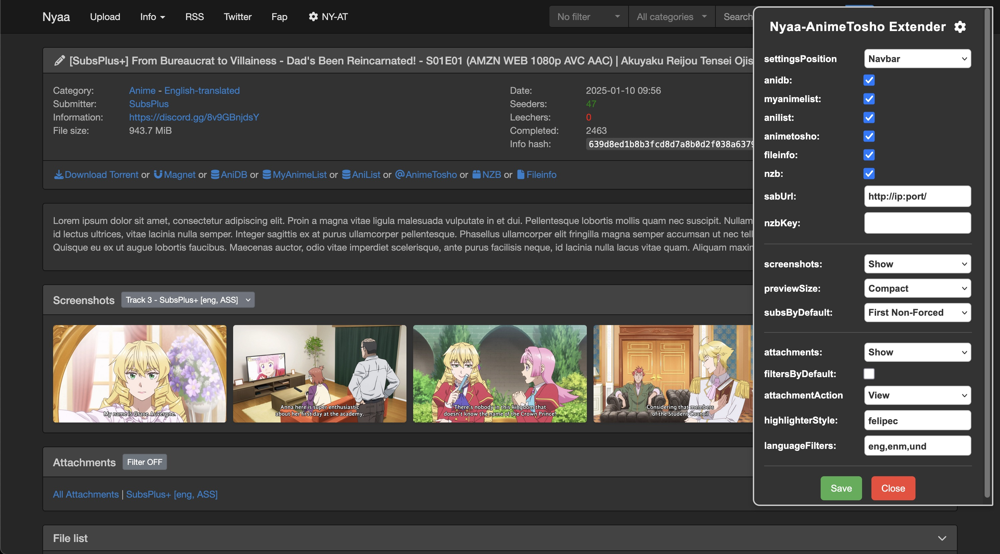
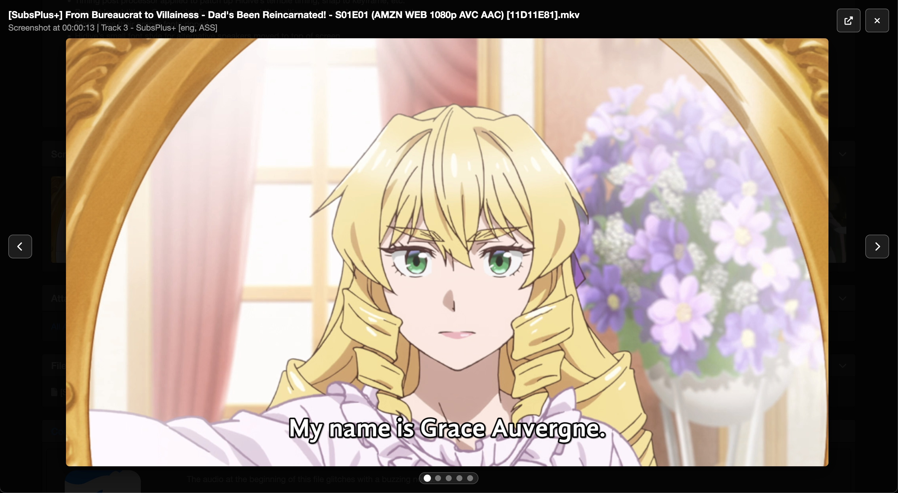

# Nyaa AnimeTosho Extender ION Fork

User script that extends Nyaa view page with AnimeTosho information. Original script by [Jimbo](https://gitea.com/Jimbo/PT-Userscripts/src/branch/main/nyaa-animetosho.user.js). All information comes from [AnimeTosho](https://animetosho.org/). AnimeTosho only scrapes the releases in the Anime English-translated category, skips big files, and takes time to process new episodes so not all pages will have complete information.

### Functionality
- Link to AnimeTosho page
- NZB link with option for unique sabUrl and NZB key
- Fileinfo for the primary file
- (New) Settings GUI to enable only the features you want
- (New) Uses font icons instead of compressed images
- (New) Link to AniDB/MyAnimeList/AniList
- (New) Screenshots with a dropdown to select which subtitle track is present in the screenshots
- (New) Full-sized screenshot viewer
- (New) Attachments download options for all tracks with language filters
- (New) Collapsible headings for everything

### Installation
1. Install a user script manager like [Violentmonkey](https://violentmonkey.github.io/).
2. Then, [click here to install script](https://github.com/IONI0/Nyaa-AnimeTosho-Extender-ION-Fork/raw/refs/heads/main/Nyaa-AnimeTosho-Extender-ION-Fork.user.js)

---

### View page

---

### Screenshot Viewer

---

### Notes
- Access the settings GUI in the top nav bar. Settings should save over updates
- sabUrl and NZB key are optional settings if you have them
- Screenshots previews are loaded as jpgs, click in to see full png
- SRT subtitles and maybe other formats are not included in the screenshot on AnimeTosho
- For batch releases, Attachments will show All Attachments for everything and the individual tracks for the first episode only

---

### Acknowledgements
- AI was heavily used for this since I do not know js/html. Apologies for code quality but I will try my best to fix any issues
- [animeApi](https://github.com/nattadasu/animeApi) for linking AniDB with other anime services